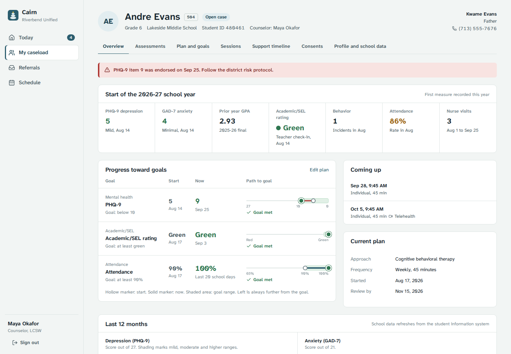
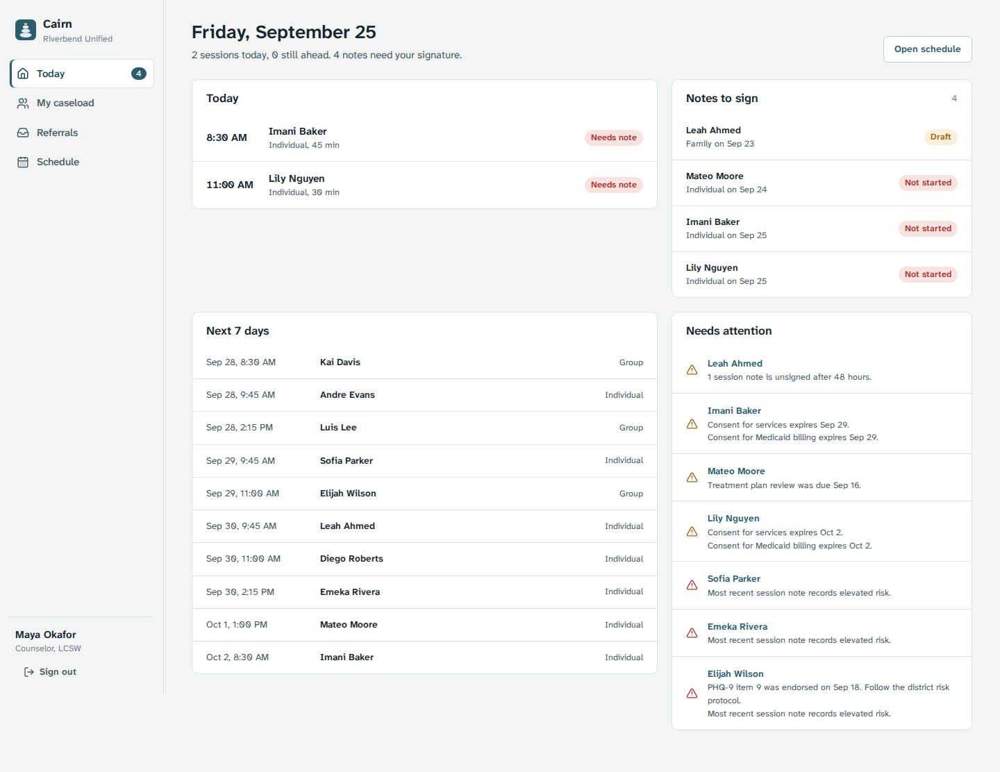
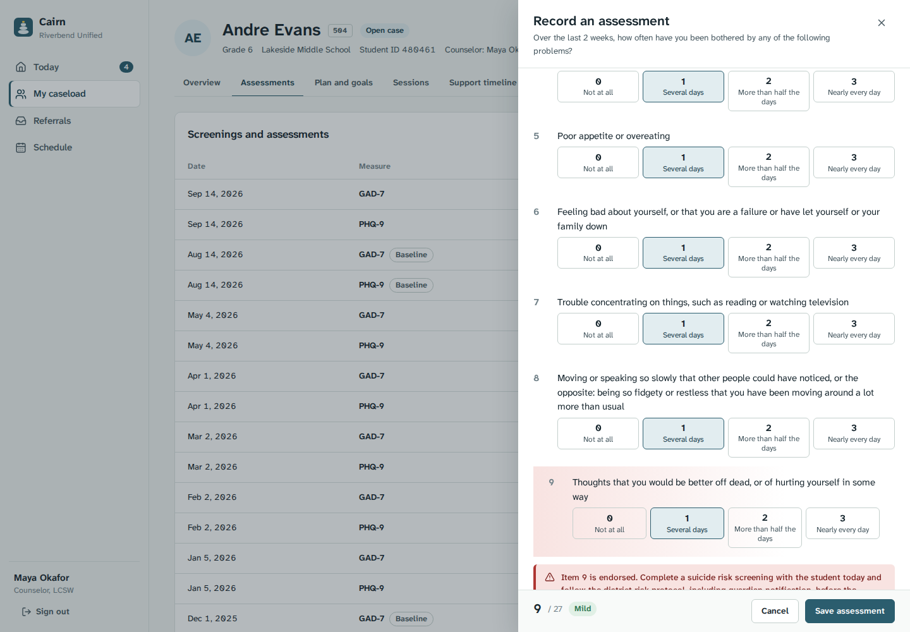

# Cairn

Case management for school-based mental health teams: referrals, guardian consent, PHQ-9 and GAD-7 screenings, treatment plans with measurable goals, sessions with signed notes, a Student 360 view, and Medicaid billing readiness.

Cairn is a portfolio project modeled on the care workflow of district mental health platforms such as MIYO Care. It is not affiliated with MIYO Health, and every person and record in the demo data is synthetic.



## What it does

| Role | Can do |
| --- | --- |
| Counselor | See their caseload and today's sessions, record assessments, build treatment plans, schedule sessions, write and sign DAP notes, record consent |
| Director (admin) | Triage referrals and assign counselors, see every student in the district, review caseloads and safety follow-ups, read the access log |
| Billing specialist | Review billing lines, see what blocks each one, export ready lines as CSV. No access to clinical notes or assessments |

The care workflow follows one student from referral to billing:

1. **Referral.** Any staff member refers a student. The director accepts (assigning a counselor opens a case) or declines with a reason.
2. **Consent.** Services, telehealth, Medicaid billing and release of information consents, with expiration and revocation.
3. **Assessment.** PHQ-9 and GAD-7 with automatic scoring against the published severity bands. A positive answer on PHQ-9 item 9 raises a safety alert.
4. **Treatment plan.** Approach, frequency, review date, and goals with a measure, target and baseline.
5. **Sessions and notes.** Scheduling, attendance, and DAP notes. Signed notes are locked; later changes go into dated addenda.
6. **Progress.** The Student 360 view shows start-of-year baselines, progress on each goal, and 12-month trends for screenings, attendance, behavior, teacher check-ins and nurse visits.
7. **Billing.** Each completed session becomes a billing line with a service code. It is exportable only when its documentation is complete.

| Counselor's day | PHQ-9 entry with item 9 safety prompt |
| --- | --- |
|  |  |

## Design decisions worth discussing

- **Progress is computed, not stored.** Goals point at a measure (PHQ-9, attendance rate, incidents per month, teacher rating). Current values and trends are calculated from the source tables, so there is one source of truth and no separate measurements table to drift out of sync. See `backend/app/clinical.py`.
- **A defined progress formula.** Progress is the share of the distance from baseline to target that has been covered, capped from 0 to 1, and a met goal counts as 1. Trend compares the latest measure with the one before it, or with the baseline when there is only one measure since the plan started.
- **Minimum necessary access.** Record access is enforced on the server for every request: counselors see only their caseload, billing staff see service metadata but not notes or scores. Every view and change is written to an audit log.
- **Billing readiness as validation.** A line is blocked if the note is unsigned, a required consent was not active on the service date, or the duration is below the minimum for the code. Students without a Medicaid ID are listed as not eligible rather than blocked. Exported sessions are locked.
- **Time handling.** Timestamps are stored as UTC. Date ranges and "today" are computed in the district's time zone (`CAIRN_DISTRICT_TIMEZONE`).
- **Legibility.** The interface uses Atkinson Hyperlegible Next, a typeface designed for low-vision readers, self-hosted so no requests go to third-party font servers.

## Stack

- **Backend:** FastAPI, SQLAlchemy 2, Pydantic 2, PostgreSQL (SQLite for zero-setup local runs), JWT auth with bcrypt, pytest
- **Frontend:** React 19, TypeScript, Vite, React Router, TanStack Query, hand-built SVG charts, plain CSS with design tokens

```
backend/
  app/
    models.py        tables
    clinical.py      instrument scoring, school-year helpers, goal progress
    billing.py       service codes and billing readiness checks
    security.py      auth, role checks, record-level access, audit helper
    queries.py       shared queries and student alerts
    routers/         auth, students, clinical, sessions, referrals, admin/billing
  seed.py            synthetic district with two school years of data
  tests/
frontend/
  src/
    pages/           Home, Students, StudentRecord (+ student/ tabs), Referrals,
                     Schedule, Billing, Audit, SessionDrawer
    charts.tsx       goal trail and trend charts
    ui.tsx           shared components
```

For a step-by-step walkthrough of how the app works and a full manual test script, see [docs/GUIDE.md](docs/GUIDE.md).

## Run it

### Locally (SQLite, no database setup)

```bash
# terminal 1
cd backend
python -m venv .venv && source .venv/bin/activate   # Windows: .venv\Scripts\activate
pip install -r requirements.txt
python -m seed                  # creates cairn.db with demo data
uvicorn app.main:app --reload   # http://localhost:8000/docs

# terminal 2
cd frontend
npm install
npm run dev                     # http://localhost:5173
```

### With Docker and PostgreSQL

```bash
docker compose up --build
```

Open http://localhost:5173. The API seeds itself on first start.

### Demo accounts

Password for all accounts: `demo1234`. The sign-in page also lists them as one-click buttons.

| Email | Role |
| --- | --- |
| maya.okafor@riverbend.example | Counselor, middle school |
| daniel.reyes@riverbend.example | Counselor, high school |
| grace.whitfield@riverbend.example | Director of Student Services |
| tom.alvarez@riverbend.example | Medicaid billing |

Seed data is generated relative to today's date, so the demo always shows a current school year. Run `python -m seed` again to reset it.

## Tests

```bash
cd backend
pytest
```

Covers scoring bands and the item 9 flag, the progress formula, role and caseload access, the note lifecycle (complete, sign, lock, addendum), referral decisions, billing export rules and the audit log.

## Not built yet

- Database migrations (Alembic). Tables are created on startup.
- Student information system integration. School data comes from the seed script.
- Built-in video for telehealth, legally binding e-signatures, multi-factor authentication.
- State-specific Medicaid rules. The service code table in `billing.py` is a configurable default.
